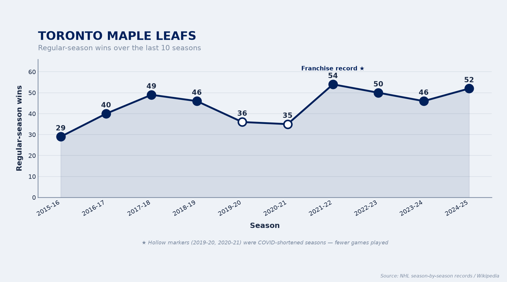
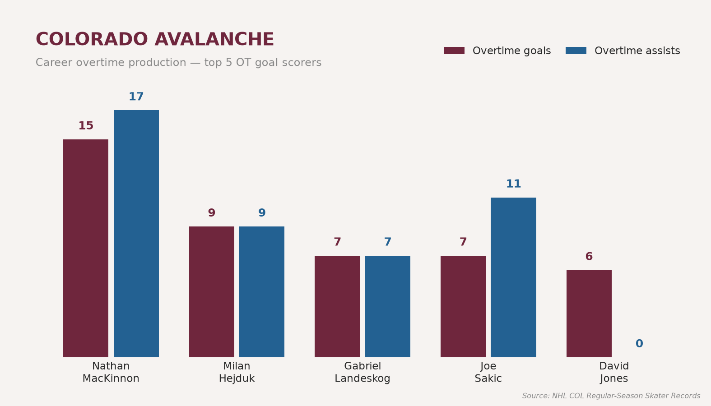

# NHL Team Colors

Pick two colors from your favorite NHL team to use in your Matplotlib
visuals. Tiny API, one dependency (Matplotlib), all 32 NHL teams built in.

- **Install name:** `vizlib`
- **Import name:** `vizlib`

## Install

```bash
pip install vizlib
```

Or from a clone of this repo:

```bash
pip install .
```

## Usage

```python
import vizlib as vz
import matplotlib.pyplot as plt

# Two brand colors as hex strings
first, second = vz.get_colors("bruins")   # ("#FFB81C", "#000000")

# ...or grab them individually
vz.primary("rangers")     # "#0038A8"
vz.secondary("rangers")   # "#CE1126"

# Use them directly in a plot
plt.bar(["A", "B"], [3, 5], color=[first, second])
plt.show()

# Or blend the two colors into a Matplotlib colormap
cmap = vz.colormap("kraken")
plt.imshow([[0, 1], [1, 0]], cmap=cmap)
plt.show()

# See what's available (all 32 NHL teams)
vz.list_teams()
```

## API

| Function | Returns |
| --- | --- |
| `get_colors(team)` | `(primary, secondary)` hex tuple |
| `primary(team)` | primary color hex string |
| `secondary(team)` | secondary color hex string |
| `colormap(team, name=None)` | a Matplotlib `LinearSegmentedColormap` |
| `list_teams()` | sorted list of available team names |

Teams are keyed by nickname (`"bruins"`, `"maple_leafs"`, `"golden_knights"`).
Names are case-insensitive and spaces, hyphens, and underscores are
interchangeable (`"Maple Leafs"`, `"maple-leafs"`, and `"maple_leafs"` all work).

## Examples

Sample charts built with the library live in [`examples/`](examples/). In each
script the team's two colors come from a single `vz.get_colors(team)` call, then
flow straight into Matplotlib.

```bash
pip install .          # installs vizlib + matplotlib
cd examples
python maple_leafs_wins.py
python avalanche_ot_goals_vs_assists.py
```

Each script writes its PNG next to itself.

### Toronto Maple Leafs — regular-season wins, last 10 seasons

Line/area chart in Leafs blue & white. Hollow markers flag the
COVID-shortened seasons.
([source](examples/maple_leafs_wins.py))



### Colorado Avalanche — career OT goals vs. assists

Grouped bars in Avalanche burgundy & blue for the franchise's top-5 overtime
goal scorers.
([source](examples/avalanche_ot_goals_vs_assists.py))



> Data: Maple Leafs win totals from NHL season-by-season records; Avalanche OT
> figures from the NHL regular-season skater records.

## License

MIT
